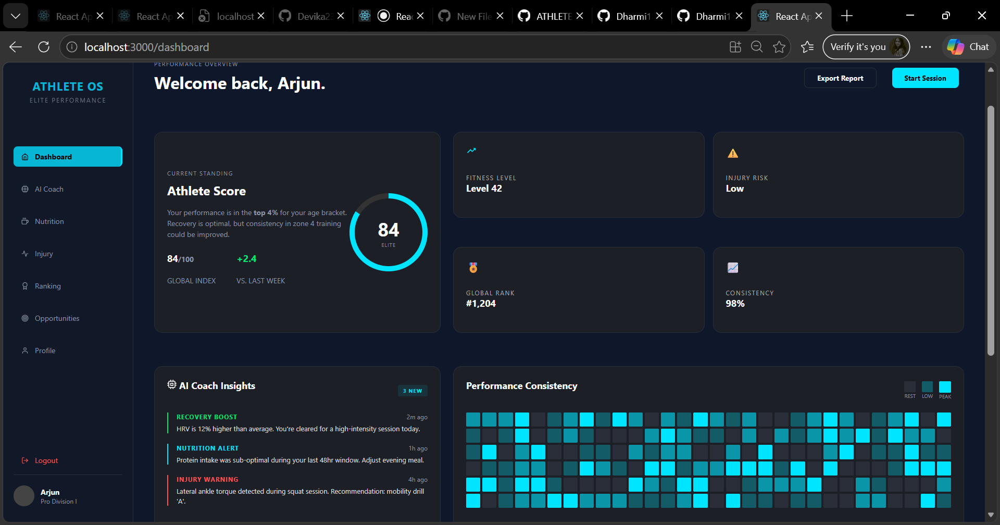
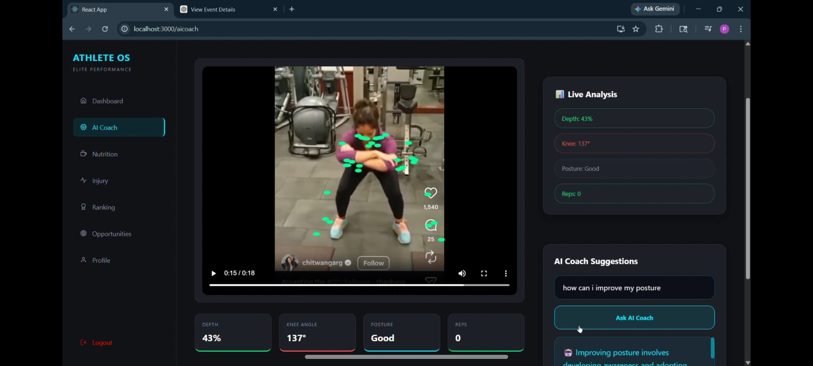
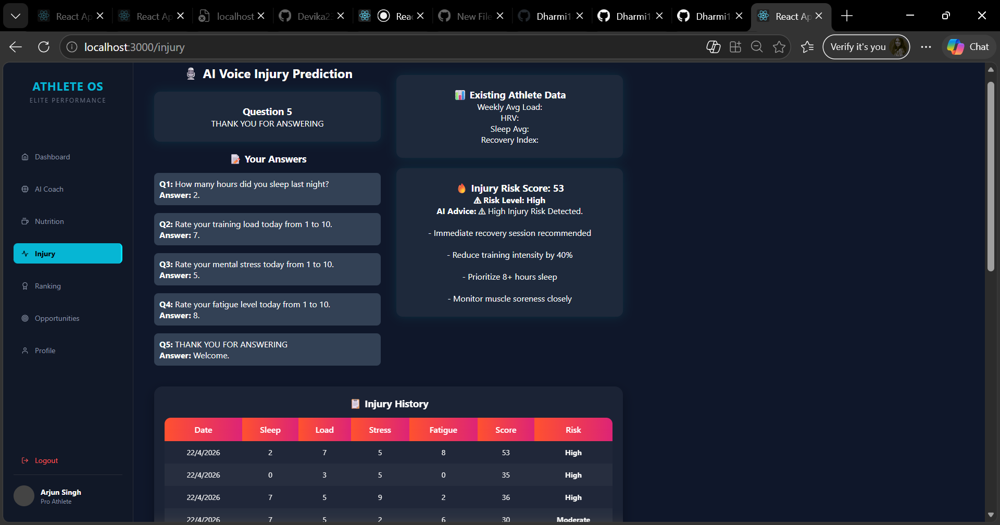
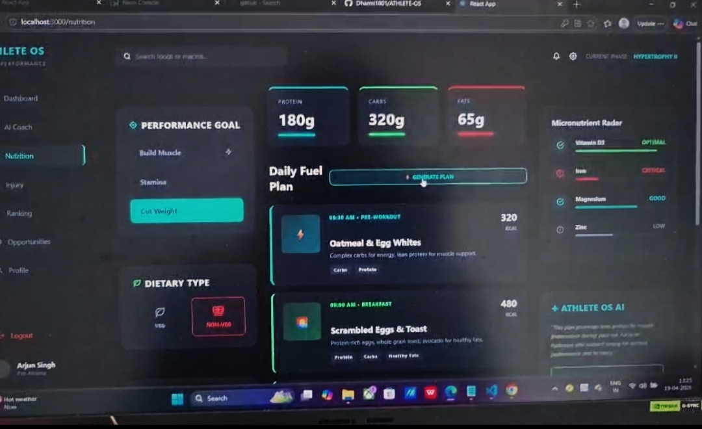

# 🏆 ATHLETE-OS
### Revolutionizing Athlete Management in the Indian Sporting Industry 🇮🇳

> A scalable AI-driven Athlete Management Platform built for holistic athlete development.

---

## 📌 Problem Statement

The Indian sporting ecosystem is growing rapidly, but athlete management remains fragmented and reactive.

### Current Challenges:
- No centralized performance tracking system  
- Reactive injury management  
- Limited AI-driven training insights  
- Lack of personalized nutrition planning  
- Poor stress and recovery monitoring  

There is a need for a unified, intelligent, technology-driven solution.

---

## 💡 Our Solution – ATHLETE-OS

ATHLETE-OS is an AI-powered athlete management ecosystem integrating:

- 🤖 AI Coach (Computer Vision-Based Form Analysis)
- 🎙 Voice-Based Injury Risk Prediction
- 🥗 AI Diet Generator
- 👤 Authentication & Athlete Profile System
- 📊 Performance Monitoring Dashboard

### Key Advantages:
- ✅ Proactive monitoring  
- ✅ AI-driven insights  
- ✅ Real-time analysis  
- ✅ Data-powered decisions  
- ✅ Athlete-centric approach  

---

# 🧠 Core Modules

---

## 1️⃣ AI Coach – Computer Vision Module

Transforms a device camera into a smart personal sports trainer.

### 🔍 Technology
- MediaPipe Pose Detection  
- Landmark Tracking  
- Motion Angle Calculations  
- Real-Time Frame Analysis  

### ⭐ Features
- Live Camera Mode  
- Workout Video Upload  
- Knee Angle Detection  
- Torso Angle Tracking  
- Squat Depth Measurement  
- Rep Counter  
- Posture Correction Alerts  
- Posture Quality Score  
- AI Coaching Assistant  

Improves biomechanics and reduces injury risk through real-time analysis.

---

## 2️⃣ Voice-Based AI Injury Risk Prediction

### 🔥 Unique Value Proposition
Predicts injury risk **before it occurs** using AI scoring logic and voice interaction.

### 🧠 Working Process
1. Daily health questions (sleep, stress, fatigue, workload)  
2. Voice converted via Azure Speech Services  
3. Custom AI risk engine calculates Injury Risk Score  
4. Risk categorized as Low / Moderate / High  
5. Recovery suggestions generated  
6. Data stored in Neon PostgreSQL  

### 🧮 Risk Score Logic
Risk Score =
(Sleep Impact) +
(Training Load) +
(Stress Level) +
(Fatigue Level)


### ⚙️ Technologies Used
- Microsoft Azure Speech Services  
- Node.js  
- Express.js  
- Neon PostgreSQL  
- Custom AI Risk Model  

### 🌟 Impact
- Early injury prevention  
- Smarter training decisions  
- Continuous health tracking  

---

## 3️⃣ AI Diet Generator

AI-powered personalized nutrition planning system.

### 🤖 Model Used
Google Gemini 2.5 Flash (`gemini-2.5-flash`)

### 🔄 Process
1. User selects goal & diet type  
2. Structured prompt sent to Gemini API  
3. AI returns structured JSON including:
   - Calories & Macros  
   - 5-Meal Plan  
   - Supplements  
   - Micronutrient Analysis  
4. Dynamic UI rendering  

### ⚙️ Technical Highlights
- Direct API integration in React  
- JSON auto-repair parsing  
- Goal-based macro adjustment  
- No backend required  

---

# 👤 Authentication & Profile Management

- Secure Login & Registration  
- Athlete Profile Creation  
- Profile Data stored in Neon PostgreSQL  
- Backend API integration via Node.js  

---

# 🛠 Tech Stack

## Frontend
- React.js  
- CSS3  
- Bootstrap  

## Backend
- Node.js  
- Express.js  

## Database
- Neon PostgreSQL (Cloud Database)  

## AI & APIs
- MediaPipe Pose Detection  
- Microsoft Azure Speech Services  
- Google Gemini API  
- Custom Risk Calculation Model  

---

# 🌍 Deployment

- Frontend → Vercel  
- Backend → Render  
- Database → Neon PostgreSQL  

---

# 👩‍💻 Team Contributions

| Name | Role | Contribution |
|------|------|--------------|
| Preeti | AI Engineer | Built AI Coach using MediaPipe and motion analysis logic |
| Aasmi Talaviya | AI & Backend Developer | Implemented Voice-Based Injury Risk Prediction System using Azure Services, built custom ML-based injury using formula,backend APIs and integrated database|
| Hema | AI Developer | Implemented Gemini-based AI Diet Generator with structured JSON rendering |
| Dharmi | Full Stack Developer | Designed complete frontend, UI/UX, login system, API integration, and deployment |

---

# ⚙️ Installation & Setup

## 1️⃣ Clone Repository

```bash
git clone https://github.com/Dharmi1801/ATHLETE-OS.git
cd ATHLETE-OS
```

---

## 2️⃣ Frontend Setup

```bash
cd frontend
npm install
npm start
```

Frontend will run on:   http://localhost:3000  

---

## 3️⃣ Backend Setup

```bash
cd backend
npm install
node server.js
```

Backend will run on:   http://localhost:5000  

---

## 4️⃣ Environment Variables
Create a `.env` file inside the **backend** folder and add:

```env
PORT=5000
DATABASE_URL=your_neon_database_url
GEMINI_API_KEY=your_gemini_api_key
AZURE_SPEECH_KEY=your_azure_key
AZURE_REGION=your_region
```
# 📸 Screenshots

## 🏠 Homepage


## 🤖 AI Coach


## 🎙 Injury Risk Prediction


## 🥗 AI Diet Generator

